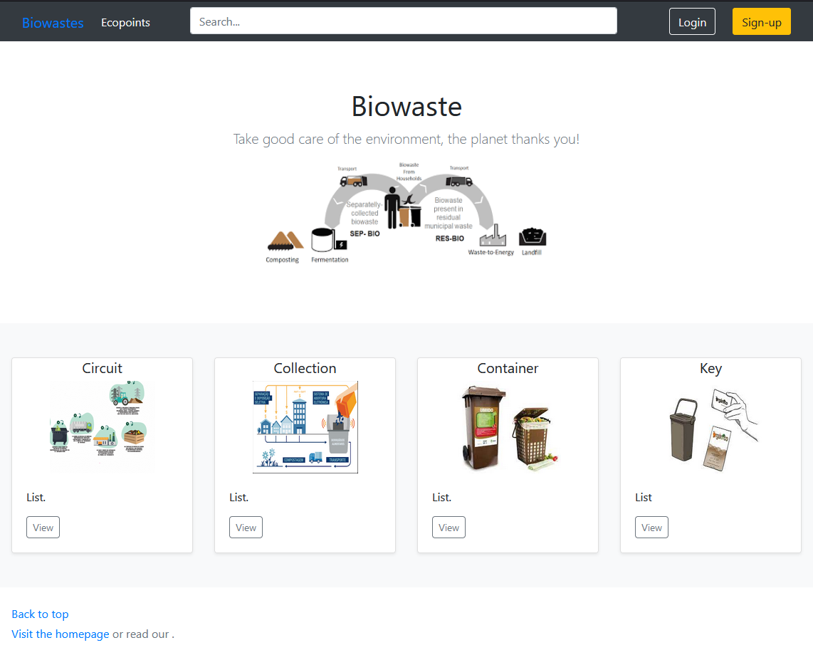

 
  

<h2 align="center"> Exploration And Control Of Systems and Integration Technologies Associated with Food Biowaste </h2>

<h3 id="about-the-project"> :scroll: About The Project</h3>

• Ensuring management information and user support through data generated by the system and information technologies associated with the
biological waste chain.
• Computer solution for data processing on the utilization of the RFID system, transmitted through two mobile reading units in two collection vehicles.

<h3 id="about-the-project"> 🛠️: Technologies used: </h3>

 

